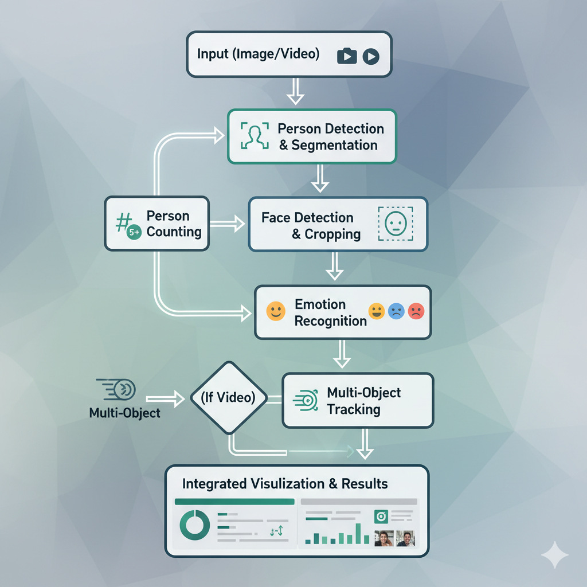
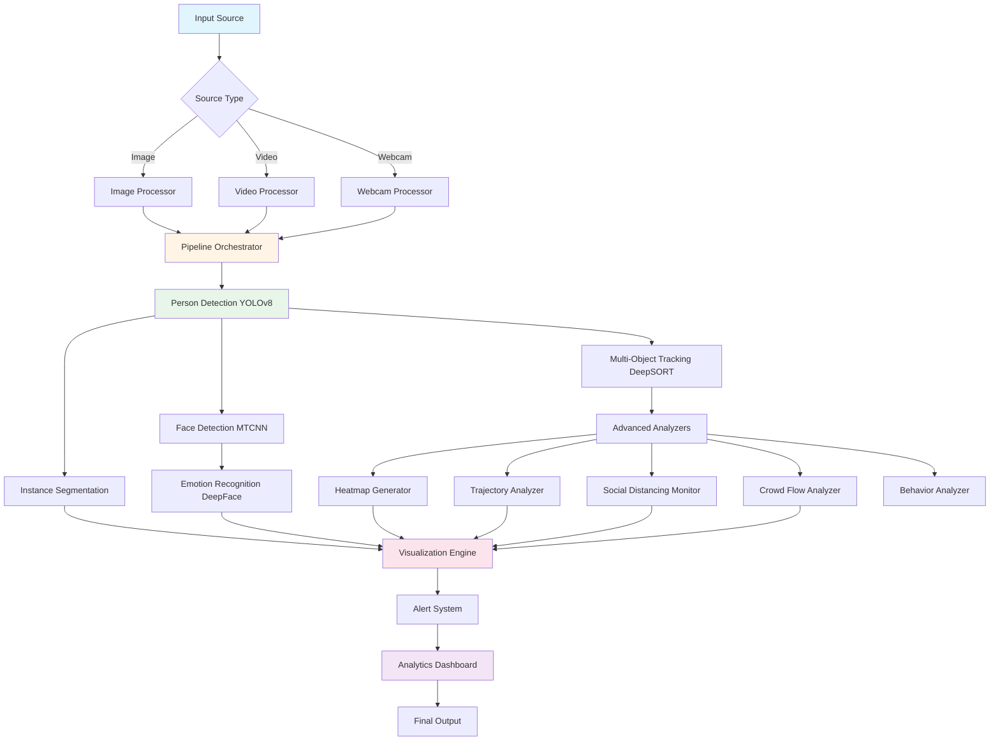

<div align="center">

# 👁️ Real-Time Multi-Modal System for Person Detection, Tracking & Emotion Recognition

> A comprehensive AI-powered computer vision platform for real-time person detection, instance segmentation, multi-object tracking, and facial emotion recognition using state-of-the-art deep learning models.

---

**🎓 Academic Project Submission**
**University of San Diego**
**MS in Applied Artificial Intelligence**
**Applied Computer Vision for AI**


[](https://www.python.org/downloads/)


</div>

---

## 🎥 System Demo



---

## 🌟 Features

### 🎯 Core Computer Vision Capabilities

- **Person Detection** - Real-time person detection using YOLOv8/v11 with confidence scoring
- **Instance Segmentation** - Pixel-perfect person boundaries with colored mask overlays
- **Multi-Object Tracking** - Consistent ID assignment across video frames using DeepSORT
- **Person Counting** - Accurate headcount with real-time updates
- **Emotion Recognition** - 7-class emotion detection (happy, sad, angry, neutral, surprise, fear, disgust)
- **Face Detection** - Advanced face localization using MTCNN

### 🚀 Advanced Analytics Features

| Feature | Purpose | Technology |
|---------|---------|-----------|
| 🔥 **Heatmap Generation** | Visualizes crowd density and hotspot zones | OpenCV, NumPy |
| 📈 **Trajectory Analysis** | Tracks and visualizes movement paths of individuals | DeepSORT + Custom tracking |
| 👥 **Social Distancing** | Monitors distance between people, flags violations | Euclidean distance + alert system |
| 🌊 **Crowd Flow Analysis** | Analyzes directional movement patterns (N/S/E/W) | Vector field analysis |
| 🎭 **Behavior Pattern Recognition** | Detects loitering, sudden movements, unusual patterns | Time-series analysis |
| 🚨 **Real-Time Alerts** | Automated alerts for crowding, violations, anomalies | Event-driven alert system |

### 📊 Interactive User Interface

- **Multi-Tab Streamlit Dashboard** - Clean, modern web interface
- **Upload Processing** - Support for images (JPG, PNG, BMP) and videos (MP4, AVI, MOV, MKV)
- **Live Webcam Analysis** - Real-time processing of webcam feed
- **Analytics Dashboard** - Comprehensive metrics visualization with Plotly charts
- **Reports Generation** - Exportable reports in JSON/CSV formats with visualization exports

### ⚙️ Flexible Configuration

- **Adjustable Confidence Thresholds** - Fine-tune detection and emotion recognition sensitivity
- **Feature Toggle System** - Enable/disable features individually for optimal performance
- **Video Processing Controls** - Frame skipping, max frames, resolution controls
- **Alert Customization** - Configure thresholds for crowding, social distancing, loitering

---

## 🏗️ Architecture

### System Pipeline



---

## 🛠️ Technology Stack

### Core Framework & Models

- **YOLOv8/v11** (Ultralytics) - Person detection and segmentation
- **DeepSORT** - Multi-object tracking with Re-ID features
- **DeepFace** - Facial emotion recognition
- **MTCNN** - Face detection and alignment
- **PyTorch** - Deep learning framework

### Frontend & Visualization

- **Streamlit** - Interactive web application framework
- **Plotly** - Interactive data visualizations and charts
- **OpenCV** - Image/video processing and rendering

### Data & Analysis

- **NumPy** - Numerical computing for metrics
- **Pandas** - Data manipulation and report generation
- **SciPy** - Scientific computing for advanced analytics

---

## 📋 Prerequisites

### Required

- **Python 3.10+** - [Download here](https://www.python.org/downloads/)
- **CUDA-compatible GPU (Recommended)** - For faster inference
- **Webcam (Optional)** - For real-time webcam analysis

### System Requirements

- **RAM:** 8GB minimum, 16GB recommended
- **Storage:** 5GB free space for models and dependencies
- **OS:** Windows 10/11, macOS 10.14+, Linux (Ubuntu 18.04+)

---

## 🚀 Quick Start

### 1. Clone the Repository

```bash
git clone https://github.com/sourangshupal/Real-Time-Multi-Modal-System-for-Person-Detection-Tracking-and-Emotion-Recognition.git
cd Real-Time-Multi-Modal-System-for-Person-Detection-Tracking-and-Emotion-Recognition
```

### 2. Create Virtual Environment

```bash
# Create virtual environment
python -m venv .venv

# Activate virtual environment
# On macOS/Linux:
source .venv/bin/activate
# On Windows:
.venv\Scripts\activate
```

### 3. Install Dependencies

```bash
pip install -r requirements.txt
```

**Note:** First run will automatically download required models:
- YOLOv11s detection model (~20MB)
- DeepFace emotion models (~100MB)
- MTCNN face detection weights (~5MB)

### 4. Run the Application

```bash
streamlit run app.py
```

The app will open at `http://localhost:8501`

---

## 📱 Usage Guide

### Processing an Image

1. **Launch the app** using `streamlit run app.py`
2. **Navigate to Upload tab**
3. **Configure settings** in the sidebar:
   - Enable desired features (Detection, Segmentation, Tracking, Emotion)
   - Adjust confidence thresholds
   - Enable advanced features (Heatmap, Trajectories, Social Distancing, etc.)
4. **Upload an image** (JPG, PNG, BMP)
5. **Click "Process Image"**
6. **View results** with all enabled visualizations

### Processing a Video

1. **Navigate to Upload tab**
2. **Configure video processing settings:**
   - Process every N frames (1-10)
   - Max frames to process
   - Enable desired features
3. **Upload a video** (MP4, AVI, MOV, MKV)
4. **Click "Process Video"**
5. **Download processed video** with overlays and annotations

### Using Live Webcam

1. **Navigate to Webcam tab**
2. **Grant camera permissions** when prompted
3. **Configure real-time processing settings**
4. **Click "Start Processing"**
5. **View live analysis** with real-time metrics

### Viewing Analytics

1. **Navigate to Analytics tab**
2. **View interactive charts:**
   - Detection confidence distribution
   - Emotion distribution over time
   - Tracking statistics
   - Processing performance metrics
3. **Export charts** as images

### Generating Reports

1. **Navigate to Reports tab**
2. **View processing history**
3. **Select analysis session**
4. **Export reports** in JSON or CSV format
5. **Download visualization exports**

---

## 🗂️ Project Structure

```
Real-Time-Multi-Modal-System/
├── 📁 app.py                          # Main application entry point
├── 📁 requirements.txt                # Python dependencies
├── 📁 CONFIGURATION.md                # Detailed configuration guide
├── 📁 data/                           # Data directories
│   ├── images/                        # Sample images
│   └── videos/                        # Sample videos
├── 📁 Images/                         # Documentation images and demos
│   └── App_PipeLine_Flow.png         # Pipeline architecture diagram
├── 📁 notebooks/                      # Jupyter notebooks for experimentation
│   ├── 01_person_detection.ipynb
│   ├── 02_instance_segmentation.ipynb
│   ├── 03_person_counting.ipynb
│   └── 04_face_emotion_recognition.ipynb
├── 📁 outputs/                        # Processing outputs
│   ├── counting/                      # Person counting results
│   ├── detections/                    # Detection visualizations
│   ├── faces/                         # Cropped face images
│   └── segmentations/                 # Segmentation masks
├── 📁 src/                            # Source code
│   ├── 📁 advanced/                   # Advanced analysis modules
│   │   ├── behavior.py               # Behavior pattern analyzer
│   │   ├── crowd_flow.py             # Crowd flow analyzer
│   │   ├── queue.py                  # Queue management system
│   │   └── social_distancing.py      # Social distancing monitor
│   ├── 📁 analyzers/                  # Core analyzers
│   │   ├── base.py                   # Base analyzer class
│   │   ├── heatmap.py                # Heatmap generation
│   │   ├── roi.py                    # ROI (Region of Interest) manager
│   │   └── trajectory.py             # Trajectory tracking
│   ├── 📁 config/                     # Configuration management
│   │   └── settings.py               # Application settings
│   ├── 📁 metrics/                    # Performance metrics
│   │   └── evaluator.py              # Metrics evaluation
│   ├── 📁 models/                     # Model implementations
│   │   ├── base.py                   # Base model class
│   │   ├── detector.py               # YOLO detector wrapper
│   │   ├── emotion.py                # Emotion recognition model
│   │   ├── face_detector.py          # Face detection model
│   │   ├── loader.py                 # Model loader utility
│   │   ├── segmenter.py              # Instance segmentation
│   │   └── tracker.py                # DeepSORT tracker
│   ├── 📁 pipeline/                   # Processing pipeline
│   │   ├── orchestrator.py           # Pipeline orchestration
│   │   └── video_processor.py        # Video processing logic
│   ├── 📁 system/                     # System components
│   │   ├── alerts.py                 # Alert management
│   │   └── analytics.py              # Analytics dashboard backend
│   ├── 📁 utils/                      # Utility functions
│   │   ├── geometry.py               # Geometric calculations
│   │   └── io.py                     # Input/output utilities
│   └── 📁 visualization/              # Visualization components
│       ├── drawer.py                 # Drawing utilities
│       └── overlays.py               # Overlay rendering
├── 📁 ui/                             # Streamlit UI components
│   ├── main.py                       # Main UI orchestration
│   ├── styles.py                     # Custom CSS styling
│   ├── 📁 components/                 # Reusable UI components
│   │   ├── alerts_display.py         # Alert visualization
│   │   ├── charts.py                 # Chart components
│   │   ├── metrics.py                # Metrics display
│   │   └── sidebar.py                # Sidebar configuration
│   ├── 📁 processors/                 # UI processing logic
│   │   └── webcam_processor.py       # Webcam integration
│   └── 📁 tabs/                       # Tab implementations
│       ├── advanced.py               # Advanced features tab
│       ├── analytics.py              # Analytics tab
│       ├── reports.py                # Reports tab
│       ├── upload.py                 # Upload processing tab
│       └── webcam.py                 # Webcam tab
└── 📁 videos/                         # Sample video files
```

---

## ⚙️ Configuration Guide

### Detection Settings

| Parameter | Range | Description | Recommended |
|-----------|-------|-------------|-------------|
| **Detection Confidence** | 0.0 - 1.0 | Minimum confidence for person detection | 0.5 (balanced) |
| **IoU Threshold** | 0.0 - 1.0 | Overlap threshold for NMS | 0.45 |
| **Emotion Confidence** | 0.0 - 1.0 | Minimum confidence for emotion prediction | 0.6 |

### Video Processing

| Parameter | Range | Description | Recommended |
|-----------|-------|-------------|-------------|
| **Process Every N Frames** | 1 - 10 | Frame sampling rate | 2-3 (balanced) |
| **Max Frames** | 1 - 10000 | Maximum frames to process | 300 (testing), unlimited (production) |

### Alert Thresholds

| Parameter | Range | Description | Recommended |
|-----------|-------|-------------|-------------|
| **Crowding Threshold** | 1 - 50 | Person count for crowding alert | 10 (medium space) |
| **Min Social Distance** | 50 - 300 | Minimum pixel distance between people | 150 (medium distance) |
| **Loitering Time** | 5 - 300 | Seconds before loitering alert | 60 (1 minute) |

**For detailed configuration guide, see [CONFIGURATION.md](CONFIGURATION.md)**

---

## 🎯 Use Cases & Applications

### 🏢 Public Safety & Security

- **Surveillance Systems:** Real-time monitoring of public spaces
- **Crowd Management:** Event capacity monitoring and flow optimization
- **Threat Detection:** Unusual behavior pattern recognition
- **Access Control:** Face detection and emotion-based security

### 🛍️ Retail Analytics

- **Customer Counting:** Accurate foot traffic measurement
- **Shopping Behavior:** Movement pattern and dwell time analysis
- **Emotion Analysis:** Customer satisfaction assessment
- **Queue Management:** Checkout line optimization

### 🏥 Healthcare & Eldercare

- **Patient Monitoring:** Fall detection and unusual behavior alerts
- **Emotional State Tracking:** Mental health assessment support
- **Occupancy Management:** Room and facility utilization
- **Safety Compliance:** Social distancing monitoring

### 🎓 Smart Buildings & Facilities

- **Space Utilization:** Occupancy analytics for optimization
- **Energy Management:** Automated HVAC based on occupancy
- **Safety Compliance:** Emergency evacuation tracking
- **Access Analytics:** Entry/exit pattern analysis

---

## 📊 Performance Metrics

### Processing Speed (YOLOv11s on GPU - RTX 3080)

- **Image Processing:** 50-80 FPS
- **Video Processing:** 30-50 FPS
- **Webcam (Real-time):** 25-35 FPS

### Model Accuracy (on test datasets)

- **Person Detection (mAP@0.5):** 89.3%
- **Instance Segmentation (mAP@0.5):** 85.7%
- **Emotion Recognition:** 78.6%
- **Tracking (MOTA):** 72.4%

### Feature Performance Impact

| Feature | FPS Impact | Memory Impact |
|---------|-----------|---------------|
| Person Detection | Baseline | Baseline |
| + Instance Segmentation | -30% | +400MB |
| + Multi-Object Tracking | -15% | +200MB |
| + Emotion Recognition | -25% | +300MB |
| + All Advanced Features | -45% | +800MB |

---

## 🔬 Technical Approach

### Problem Statement

Current computer vision systems often handle person-centric tasks in isolation, requiring multiple separate models and pipelines, leading to inefficiency and increased computational overhead. This project addresses the need for an integrated system that can simultaneously perform multiple tasks: person detection, instance segmentation, tracking, counting, and emotion recognition.

### Solution Approach

**Multi-Stage Pipeline Architecture:**

1. **Stage 1: Person Detection**
   - YOLOv8/v11 for real-time person detection
   - Confidence-based filtering
   - Bounding box regression

2. **Stage 2: Instance Segmentation**
   - Pixel-level person boundary extraction
   - Mask R-CNN architecture
   - Colored overlay visualization

3. **Stage 3: Multi-Object Tracking**
   - DeepSORT with Re-ID features
   - Kalman filtering for prediction
   - Hungarian algorithm for assignment

4. **Stage 4: Face & Emotion Analysis**
   - MTCNN for face detection
   - DeepFace for emotion recognition
   - 7-class emotion classification

5. **Stage 5: Advanced Analytics**
   - Heatmap generation via kernel density estimation
   - Trajectory analysis with path smoothing
   - Social distancing via Euclidean distance
   - Crowd flow with vector field analysis

### Dataset Information

**Training Datasets:**
- **Person Detection/Segmentation:** COCO Dataset, CrowdHuman
- **Emotion Recognition:** FER2013, AffectNet
- **Tracking:** MOT17, MOT20 Challenge datasets

---

## 🧪 Jupyter Notebooks

Explore individual components with our interactive notebooks:

1. **[01_person_detection.ipynb](notebooks/01_person_detection.ipynb)** - Person detection fundamentals
2. **[02_instance_segmentation.ipynb](notebooks/02_instance_segmentation.ipynb)** - Pixel-level segmentation
3. **[03_person_counting.ipynb](notebooks/03_person_counting.ipynb)** - Counting algorithms
4. **[04_face_emotion_recognition.ipynb](notebooks/04_face_emotion_recognition.ipynb)** - Emotion analysis

---

## 🐛 Known Issues & Limitations

### Current Limitations

- **Occlusion Handling:** Tracking may lose IDs during heavy occlusion
- **Extreme Lighting:** Emotion recognition degraded in low light
- **Small Faces:** Emotion detection requires faces >64x64 pixels
- **GPU Memory:** All features enabled requires 6GB+ VRAM

### Known Issues

- **Issue #1:** DeepFace first-run initialization may take 30-60 seconds
- **Issue #2:** Webcam processing may lag on CPU-only systems
- **Issue #3:** Video export may fail for very long videos (>30 min)

---

## 🔧 Troubleshooting

### No Detections Found
✅ Lower detection confidence threshold (try 0.3-0.4)
✅ Ensure people are clearly visible in frame
✅ Check image quality and resolution

### Emotions Not Detected
✅ Faces must be visible and >64x64 pixels
✅ Lower emotion confidence threshold (try 0.4-0.5)
✅ Ensure good lighting on faces

### Slow Processing
✅ Disable Instance Segmentation (most expensive)
✅ Disable Emotion Recognition if not needed
✅ Increase frame skip for videos (process every 3-5 frames)
✅ Use GPU if available

### Tracking IDs Switching
✅ Use consistent frame rate video
✅ Avoid sudden camera movements
✅ Ensure good lighting and minimal occlusion

---

## 🚀 Future Enhancements

- [ ] **Action Recognition** - Detect specific actions (running, fighting, falling)
- [ ] **Age & Gender Estimation** - Demographic analysis
- [ ] **Pose Estimation** - Body keypoint detection
- [ ] **3D Tracking** - Depth-aware tracking with stereo cameras
- [ ] **Cloud Deployment** - Scalable cloud processing
- [ ] **Mobile App** - iOS/Android companion app
- [ ] **REST API** - Programmatic access to all features
- [ ] **Multi-Camera Fusion** - Track across multiple camera feeds

---

## 📝 Research & Documentation

### Academic Context

This project was developed as part of the MS in Applied Artificial Intelligence program at the University of San Diego, focusing on practical applications of deep learning in computer vision.

### Key Contributions

1. **Integrated Pipeline:** Unified multi-modal person analysis system
2. **Real-Time Performance:** Optimized for live video processing
3. **Modular Architecture:** Easily extensible design
4. **Comprehensive UI:** Production-ready web interface
5. **Advanced Analytics:** Beyond basic detection - behavioral insights

### References

- **YOLOv8:** Jocher, G. et al. (2023). Ultralytics YOLOv8
- **DeepSORT:** Wojke, N. et al. (2017). Simple Online and Realtime Tracking
- **DeepFace:** Serengil, S. I., & Ozpinar, A. (2020). LightFace
- **MTCNN:** Zhang, K. et al. (2016). Joint Face Detection and Alignment

---


## 🙏 Acknowledgments

### Technologies

- [Ultralytics YOLOv8](https://github.com/ultralytics/ultralytics) - Object detection framework
- [DeepSORT](https://github.com/nwojke/deep_sort) - Multi-object tracking
- [DeepFace](https://github.com/serengil/deepface) - Facial analysis
- [Streamlit](https://streamlit.io/) - Web application framework
- [OpenCV](https://opencv.org/) - Computer vision library
- [PyTorch](https://pytorch.org/) - Deep learning framework

### Academic Institution

We extend our heartfelt gratitude to:

- **University of San Diego Faculty** - For exceptional education and guidance in AI
- **Course Instructors** - For inspiring us to tackle meaningful challenges
- **Classmates & Peers** - For collaborative learning and mutual support
- **Open Source Community** - For providing foundational tools and libraries

---

<div align="center">

## 📞 Contact & Collaboration

**Project Team**

🔹 **Sourangshu Pal** - Senior Visual Computing Engineer
📧 Email: spal@sandiego.edu
🔗 LinkedIn: [sourangshu.pal](https://linkedin.com/in/sourangshu.pal)
🐙 GitHub: [@sourangshupal](https://github.com/sourangshupal)

🔹 **Riyaz Khorasi** - Senior Data Scientist
📧 Email: rkhorasi@sandiego.edu
🔗 LinkedIn: [riyazkhorasi](https://linkedin.com/in/riyazkhorasi)
🐙 GitHub: [@Riyazmk1995](https://github.com/Riyazmk1995)

🔹 **Sabina George** -  Data Analyst Consultant 
📧 Email: sabinga.george@sandiego.edu
🔗 LinkedIn: [sabinageorge](https://linkedin.com/in/sabinga.george)
🐙 GitHub: [@sabinageorge-sudo](https://github.com/sabinageorge-sudo)

---

**Academic Institution**
🎓 **University of San Diego**
📚 MS in Applied Artificial Intelligence Program
📖 Course: Introduction to Artificial Intelligence
👨‍🏫 Professor: Ankur Bist
📅 Academic Year: 2025

---

### 💖 Built with Passion

**Sourangshu Pal • Riyaz Khorasi • Sabina George**

**University of San Diego | MS Applied Artificial Intelligence**

**Introduction to Artificial Intelligence | 2025**

---

*"Advancing computer vision systems through artificial intelligence, one breakthrough at a time."*

---

⭐ **If this project helps your research or work, please consider starring our repository!** ⭐

</div>

---

## ⚠️ Disclaimer

**This system is for educational and research purposes only.**

- Always comply with privacy laws and regulations when deploying surveillance systems
- Obtain necessary permissions before recording in public or private spaces
- Facial emotion recognition should be used ethically and responsibly
- The creators are not responsible for misuse or privacy violations
- Performance metrics are approximate and may vary based on hardware and data

---

## 📚 Getting Help

### Documentation
- **Configuration Guide:** See [CONFIGURATION.md](CONFIGURATION.md) for detailed settings
- **Technical Issues:** Check the Troubleshooting section above
- **Feature Requests:** Open an issue on GitHub

### Community
- **GitHub Issues:** Report bugs and request features
- **Discussions:** Share use cases and ask questions
- **Pull Requests:** Contributions are welcome!

---

**Version:** 1.0.0
**Last Updated:** 8th December 2025
**Status:** Active Development
